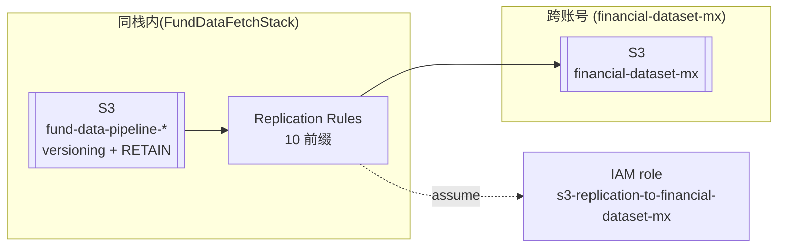
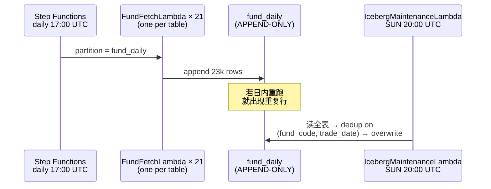
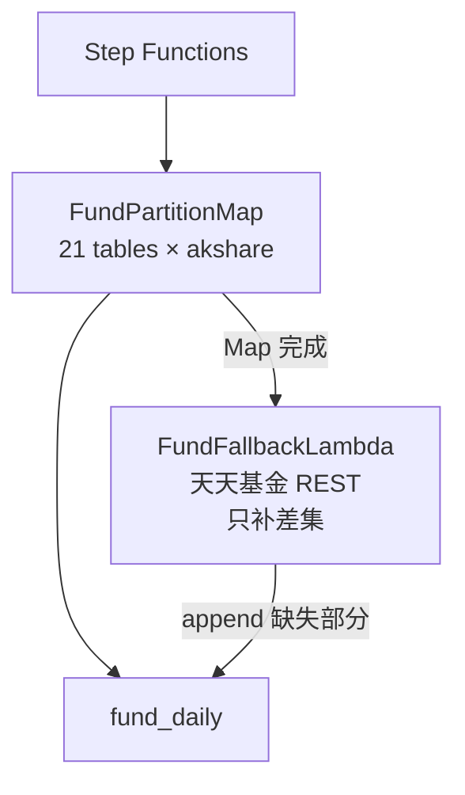
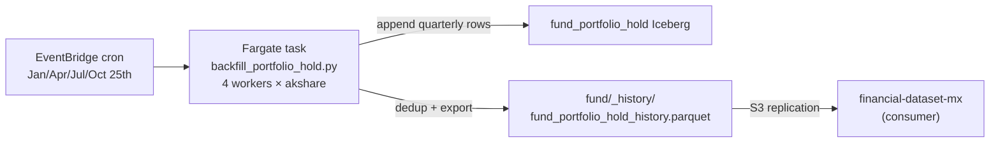

# 公募基金数据管道 — 设计文档

> **面向读者**：接手/评审这个数据管道的工程师、下游数据消费者（如量化研究团队）。
> **阅读建议**：只讲**设计决策**、**为什么这么做**、**故障模式**。实现细节（Lambda 拆几片、锁重试次数、IAM 具体字符串）参见 CDK 源码。
> **术语**：**开放式基金**、**净值**、**Iceberg 表**、**跨账号复制**加粗；真实代码标识符如 `fund_daily`、`fund_open_fund_daily_em` 用反引号。

---

## 背景与目标

### 硬约束（用户/上游给定，不可推翻）

- **数据落地在 AWS 上**，账号 `463470973226`（`us-east-1`）；单向复制给消费方账号 `845861764576`（bucket `financial-dataset-mx`）。
- **上游数据源默认是 akshare**（免费、社区维护、周期性 breaking change），本项目**不采购付费行情**。
- **消费方对外接口是扁平 parquet**，不是 Iceberg：`fund_history/trade_month=YYYY-MM/part-0.parquet` 和 `fund/_history/*.parquet`。消费方**不加载 Iceberg catalog**。
- **AWS AppSec 禁止公网可访问资源**：桶必须 `blockPublicAccess: ALL`，无 `Principal: "*"` 策略，不允许开 Lambda Function URL。

### 功能性需求

- 每交易日 T+1 (UTC 17:00, 北京 T+1 01:00) 拉取全市场公募基金**当日净值**、**排行**、**费率**、**持仓明细**、**基金经理**等，落地成 Iceberg 表 + 扁平 parquet 快照。
- **hist_kline**（A 股/港股/美股）1 年滚动窗口每日刷新。
- **持仓穿透（fund_portfolio_hold）**：每季度末披露窗口之后拉取全市场基金的重仓股。

### 非功能性需求

- **可复现的失败**：任何一天的数据缺失都能在**当天**追平；主流程失败不能悄悄成功（`SUCCEEDED` 状态必须真实反映数据落地）。
- **单点删除不能带走数据**：栈的删除只能删元数据，不能删数据。
- **消费方不需要拉全表**：给孟老板的月度扁平 parquet 是"给一份数据就用"的，不要求他懂 Iceberg。

---

## 模块 1 — 数据桶所有权

### 问题

**2026-06-12 事故**：数据桶 `fsi-investmentadvisory-data-*` 由一个跟数据无关的 CloudFormation 栈（`InvestmentAdvisory`）持有。当运维人员 `cdk destroy` 该栈时，`autoDeleteObjects` 触发的自定义资源**清空了整个桶**，随后桶被删除。所有 Iceberg 表 + 扁平 parquet 一并消失。

事故之后当天的 `FundDataCollectionWorkflow` Step Functions **继续报 `SUCCEEDED`**，因为写入失败被 `Catch` 节点吞掉转为 `success=false` 分支，但整个 Parallel 分支的 `success` 由 Map 状态决定，Map 状态本身正常返回——工作流层面看不出异常。孟老板反馈"数据只到 6/11"我们才发现。

### 方案

**数据桶由 `FundDataFetchStack` 亲自 provision**，`RemovalPolicy.RETAIN` + `autoDeleteObjects: false`；即使有人 `cdk destroy FundDataFetchStack`，CFN 也只会 detach 桶不会删数据。

跨账号复制规则跟随桶一起在同一个栈里定义（复用 destination-side 现有 IAM role，不动消费方账号）。**桶名换成 `fund-data-pipeline-<account>-<region>`**，明确"这个桶属于 fund-data 管道"。

### 架构图

---

## 模块 2 — fund_daily 写入模式：append-only

### 问题

`fund_daily` 表存储 25k+ 只公募基金每日净值，历史深度 20+ 年——数据量约 **3000 万行**。原始设计用 pyiceberg 的 `upsert` API，语义上正确：以 `(fund_code, trade_date)` 为 key，重跑幂等。

但 pyiceberg upsert 的实现是**读全表 → dedup → overwrite**，在 Lambda 上：
- 读 3000 万行 + Arrow 反序列化 → **~15 分钟**（Lambda 硬上限 900s）。
- pyiceberg-core Rust 层还偶发 SIGSEGV（`exitcode=-11`），触发子进程 fallback 到 append，反而制造重复行。

### 方案

**放弃 upsert，走纯 append**。`fund_daily` 是时序表，每日只追加"今日各基金净值"这一小片，没有更新旧行的语义需求。同日重跑会产生重复行，但由**每周日的 `IcebergMaintenanceLambda`**统一去重（按 `(fund_code, trade_date)` 保留最新一条）。

代价：日内查询理论上会看到重复行——但每天只跑一次 cron，重跑是运维手动动作，可以在下一次 weekly maintenance 前避免消费方查询该日数据（实际上没有触发过）。

### 架构图

---

## 模块 3 — 事故窗口的 fallback 数据源

### 问题

**2026-06-12 → 06-16 数据空缺**：桶被删后，主流程虽然重建，但**辅助表**（`fund_money_daily` / `fund_etf_daily` / `fund_graded_daily` / `fund_reits_daily` / `fund_financial_daily`）跟着 Iceberg schema 从 6/17 才重新有数据——事故那五天各类基金对应的行**永久性缺失**。

孟老板反馈全市场 **3,278 只基金 6/12-6/16 集中停更**，QDII/FOF 是重灾区。

akshare 的每日快照接口 `fund_open_fund_daily_em` 是**无参数快照**，只返回"今天 + 昨天"——**没有历史查询能力**。单只历史接口 `fund_open_fund_info_em(code, "单位净值走势")` 支持历史深度，但对**货币基金**抛 `Data_netWorthTrend undefined`（货币基金没单位净值的概念）。

### 方案

**新增数据源：天天基金 REST API** `api.fund.eastmoney.com/f10/lsjz`。它是东方财富基金页面的后端接口，用 `Referer` header 就能调，覆盖面广（货币基金、后端 share class、周末数据都能拿到），单只调用 ~1.8s。

设计成**双源**：
- **主源**（akshare 快照）→ fast path，覆盖 ~24k 只主流基金。
- **fallback**（天天基金 REST）→ 主源写完之后的 SFN 下一步，扫 "**在 `fund_name` universe 但今日 `fund_daily` 里没有的**" 差集，只补漏。

fallback 失败不影响主流程（`Catch` 吞掉），因为主源是真理源。

### 架构图

**替代数据源的覆盖差异**（实测 6/12-6/16 空缺）：

| 类别 | akshare 快照 | akshare 单只历史 | 天天基金 REST |
|---|---|---|---|
| 主流开放式基金 | ✅ | ✅ | ✅ |
| 货币基金 | ✅（当日） | ❌ JS bug | ✅（含周末万份收益）|
| ETF/LOF | ✅（当日）| 部分 empty | ✅ + `fund_etf_hist_em` |
| QDII 主 share | ✅ | ✅ | ✅ |
| QDII 美元现汇/后端 C/D | ❌ | ❌ | ❌ |
| FOF 三个月持有 | ✅（开放日）| 仅开放日 | 仅开放日 |

**明确排除**：`fund_money_fund_info_em` 上游 CDN 慢/超时，不用；QDII 特殊 share class 全数据源都没数据，不做尝试。

---

## 模块 4 — 持仓穿透（fund_portfolio_hold）

### 问题

**基金持仓明细**（每只基金前十大重仓股 + 全部持仓，季报披露）**属于 low-frequency、long-tail 数据**：
- 全市场 27k 只基金 × 每季 1 次披露 × ~40 只股票 = 每次刷新百万行级别。
- 单只调用 `fund_portfolio_hold_em(code, year)` 需要 ~1s；4 并发下全市场刷一次 **~15 小时**。
- Lambda 15 min 硬上限**装不下**。
- 又不能天天跑（数据只季度更新，浪费 akshare 配额）。

### 方案

**季度独立 Fargate 任务**（复用已有的 `FundHistoryBackfill` task definition，`8 GiB / 2 vCPU`）：

- EventBridge cron 每季度末次月 25 日 20:00 UTC 触发（~3 周披露 buffer）。
- 任务通过 `--mode portfolio` 参数分派到 `backfill_portfolio_hold.py`。
- **按季度粒度幂等**：脚本启动时读目标 Iceberg 表**在当季 `report_date` 上**的 `fund_code` 集合，跳过已有；只有缺当季披露的基金会被再拉一次。历史季度是稳定披露，一旦有行就冻结。首次全量 backfill 后，后续每季 wall-clock 从 ~15h 缩到 ~2-3h。
- **过滤 equity-like universe**：从 27k universe 里剔除掉命名含 `债/货币/REITs` 的（这些没有股票持仓），把 API 调用量降到 19k → 命中率 ~78%。
- **末尾自动 export** 扁平 parquet 到 `fund/_history/fund_portfolio_hold_history.parquet`，走复制规则同步给消费方——**不需要下游装 Iceberg**。

### 架构图

---

## 模块 5 — 数据交付契约

### 问题

消费方（下游研究团队）**不加载 Iceberg**，不熟悉分区 pruning。同时消费方桶跨账号，我们只能"推给他"，不能让他拉。

### 方案

**给消费方看的只有扁平 parquet**：

- **月度净值**：`fund_history/trade_month=YYYY-MM/part-0.parquet`——由 `ExportFundHistoryLambda` 每日刷新本月，历史月份稳定不变。
- **持仓明细**：`fund/_history/fund_portfolio_hold_history.parquet`——季度全量 dedup + 覆盖式写。
- **基金经理任期**、**规模历史**：`fund/_history/fund_manager_history.parquet` / `fund_scale_history.parquet`——`FundHistoryFetchWorkflow` 各自的产物。

**S3 replication rule 只挂 flat parquet 前缀**（`fund/`、`fund_history/`），**不复制 `iceberg/`**——因为 Iceberg metadata 对消费方无意义，还会引入 GB 级流量。

**桶名跟消费方桶名不同、不重叠**——避免任何 name-based 混淆。

---

## 运维 & 成本

**每日 Step Functions 执行时长**：约 12-18 分钟（21 个 fund partition 并发 + `hist_kline` × 9 分区 + 其他市场 + export）。

**Lambda 成本**：Fund fetch × 21 分片 × 每片 ~1 min ≈ 21 GB·s/天。所有 Lambda 加起来 **< $10/月**。

**Fargate 成本**：季度 portfolio backfill 一次 ~15h × 8 GiB / 2 vCPU ≈ **$3/季度**。

**S3**：Iceberg 表加起来 ~5 GB；跨账号 replication 流量约每天 100 MB → **< $5/月**。

**监控**：`FundDataFetchStack-FundDataFetchAlerts` SNS topic 订阅关键 Lambda 错误 + Step Functions FAILED；每周日 Iceberg maintenance 之后自动 CloudWatch metric 上报表大小。

---

## 测试策略

**没有单元测试**——数据管道本质上是**上游 akshare 接口的 wrapper**，锁上游 fixture 意义有限（akshare 每几周就会 breaking change 一次列名）。

替代做法：
- **端到端 Smoke**：任何 CDK deploy 后手动触发一次 SFN，验证 raw + iceberg + flat parquet 都写入新 pipeline。
- **每日 SFN status monitoring**：连续两天 FAIL 立即报警。
- **一致性抽样**：孟老板反馈机制——每次数据用户反馈缺失，回溯 CloudWatch + Step Functions history 对齐。

---

## 明确排除在外

- **回填货币基金 6/12-6/16 全周期**：akshare 侧无历史接口，天天基金 API 对货币基金`DWJZ`（单位净值）字段返 null（业务上货基没单位净值）——不做。
- **QDII 美元现汇/后端 C/D share class 历史**：akshare + 天天基金上游都没数据，不做。
- **Iceberg 表实时查询接口**：消费方走 flat parquet；不部署 Athena/Trino/Spark。
- **实时（intra-day）净值**：公募基金只 T+1 披露，不追实时。

## 待确认的开放问题

- **QDII / 海外主题基金替代数据源**：能不能通过 Wind / 天天基金**其他端点**取到 QDII 特殊份额的历史？需要 spike 验证。
- **消费方查询模式对齐**：目前只提供 flat parquet 月度切片；如果消费方以后按 fund_code 时序访问，是否重新分区（例如 `fund_code_hash=NN/`）？
